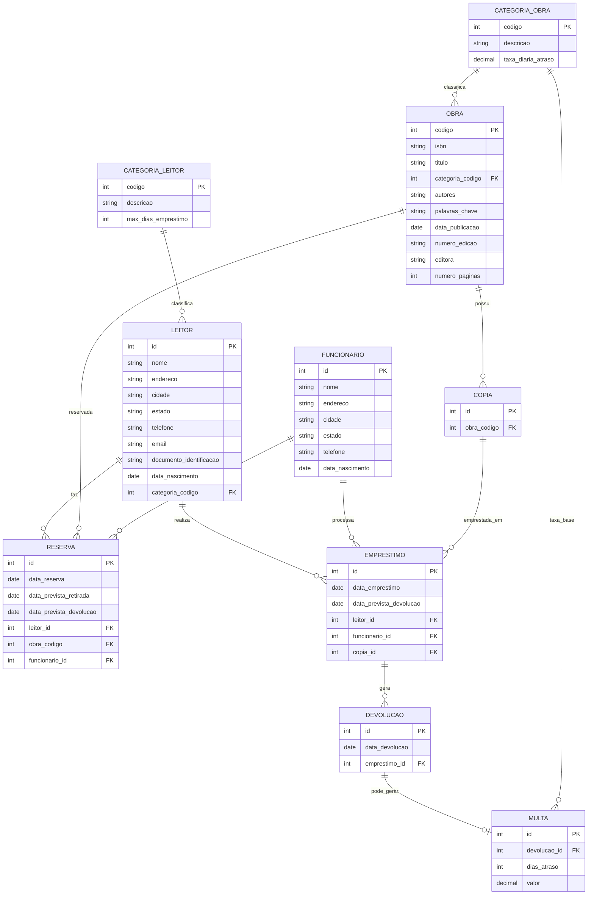

```mermaid
erDiagram
  CATEGORIA_LEITOR {
    int codigo PK
    string descricao
    int max_dias_emprestimo
  }

  LEITOR {
    int id PK
    string nome
    string endereco
    string cidade
    string estado
    string telefone
    string email
    string documento_identificacao
    date data_nascimento
    int categoria_codigo FK
  }

  CATEGORIA_OBRA {
    int codigo PK
    string descricao
    decimal taxa_diaria_atraso
  }

  OBRA {
    int codigo PK
    string isbn
    string titulo
    int categoria_codigo FK
    string autores
    string palavras_chave
    date data_publicacao
    string numero_edicao
    string editora
    int numero_paginas
  }

  COPIA {
    int id PK
    int obra_codigo FK
  }

  FUNCIONARIO {
    int id PK
    string nome
    string endereco
    string cidade
    string estado
    string telefone
    date data_nascimento
  }

  RESERVA {
    int id PK
    date data_reserva
    date data_prevista_retirada
    date data_prevista_devolucao
    int leitor_id FK
    int obra_codigo FK
    int funcionario_id FK
  }

  EMPRESTIMO {
    int id PK
    date data_emprestimo
    date data_prevista_devolucao
    int leitor_id FK
    int funcionario_id FK
    int copia_id FK
  }

  DEVOLUCAO {
    int id PK
    date data_devolucao
    int emprestimo_id FK
  }

  MULTA {
    int id PK
    int devolucao_id FK
    int dias_atraso
    decimal valor
  }

  CATEGORIA_LEITOR ||--o{ LEITOR : "classifica"
  CATEGORIA_OBRA ||--o{ OBRA : "classifica"
  OBRA ||--o{ COPIA : "possui"

  LEITOR ||--o{ RESERVA : "faz"
  OBRA ||--o{ RESERVA : "reservada"
  FUNCIONARIO ||--o{ RESERVA : "registra"

  LEITOR ||--o{ EMPRESTIMO : "realiza"
  FUNCIONARIO ||--o{ EMPRESTIMO : "processa"
  COPIA ||--o{ EMPRESTIMO : "emprestada_em"

  EMPRESTIMO ||--o{ DEVOLUCAO : "gera"
  DEVOLUCAO ||--o| MULTA : "pode_gerar"

  CATEGORIA_OBRA ||--o{ MULTA : "taxa_base"
```
